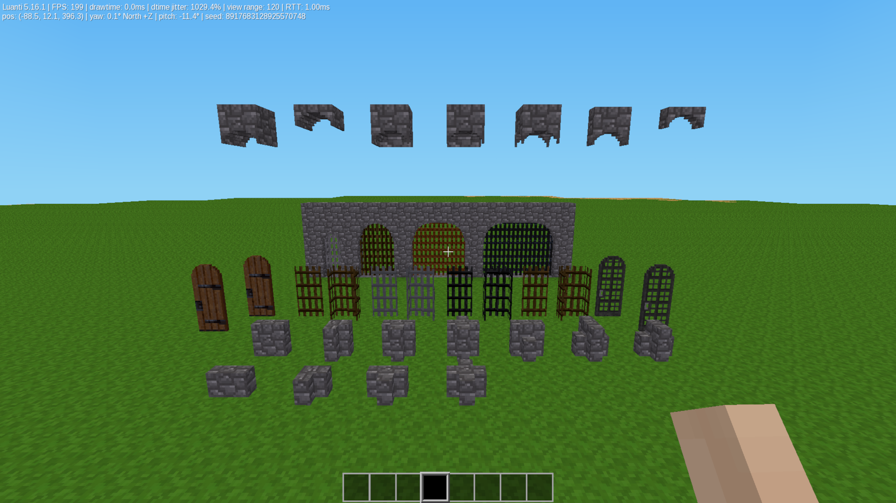

# Build Pack 01 (`build_pack_01`)

A comprehensive architectural and design modpack for **Minetest Game / Luanti**, created by **TumeniNodes**.

This collection provides advanced structural elements, automated systems, and high-security boundaries designed to seamlessly interlock, eliminating visual clipping and alignment errors in your builds.

## Included Mods

* **Arches (`arches`):** Space-saving architectural nodebox arch blocks and interlocking junction pieces for clean masonry vaulting.
* **Portcullis (`portcullis`):** Heavy duty 3D gates.
* **Single Arch Doors (`single_arch_doors`):** Custom-meshed doors shaped to place cleanly underneath masonry arches without clipping.
* **Thin Walls (`thin_walls`):** Full-height and low partition wall dividers that fit into partial node offsets to maximize interior space.
* **Super High Fences (`super_high`):** Triple-height boundary panels and columns created for fortifications, and perimeter control, and can be used as windows.

## Shared Features

* **Light Animations:** Doors and gates utilize custom multi-stage paths for animated Illusion.
* **Optimized Rendering:** Explicit backface culling layouts prevent interior transparency glitches.
* **Material Integration:** Fully supports up to 24 core vanilla materials including brick varieties, stone variants, and timber types.
* **Survival Balanced:** Integrated recipes dynamically scale output items based on total block material volume.

## Installation

1. Download the repository and extract the archive.
2. Ensure the root folder is named exactly `build_pack_01`.
3. Place the folder inside your world's `mods/` directory or global `mods/` path.
4. Enable `build_pack_01` in your world configuration menu.

## License

* **Source Code:** MIT License (See `LICENSE` for details)
* **Media Assets:** CC-BY-SA 4.0 (See `LICENSE` for details)

