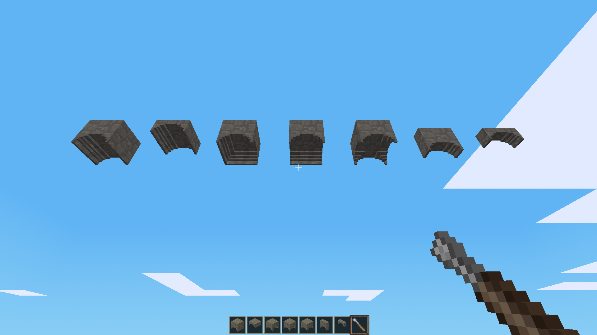

# Arches (`arches`)

A standalone architectural modification for **Minetest Game / Luanti**, created by **TumeniNodes**. Part of the `build_pack_01` collection.

This mod adds highly customizable nodebox arch blocks and interlocking junction pieces to allow for clean vaulting, structural frames, and historic masonry transitions.

## Features

* **Various Nodes:** Standard Arches, Half Arches, Thin Arches, Thin-Half Arches, and multi-way intersections (Two-Way, Three-Way, and Four-Way variants).
* **Materials:** Fully supports 24 vanilla materials including Brick, Clay, Cobble, Mossy Cobble, Stone Block/Brick, Sandstone Block/Brick, and all default wood types.
* **Survival Ready:** Features fully integrated crafting recipes that dynamically adapt outputs based on the material volume utilized.

## Installation

Ensure this folder is placed inside your world's `mods/` directory or parent modpack folder and named exactly `arches`.

## License

* **Source Code:** MIT License (See `LICENSE` for details)
* **Media Assets:** CC-BY-SA 4.0 (See `LICENSE` for details)

