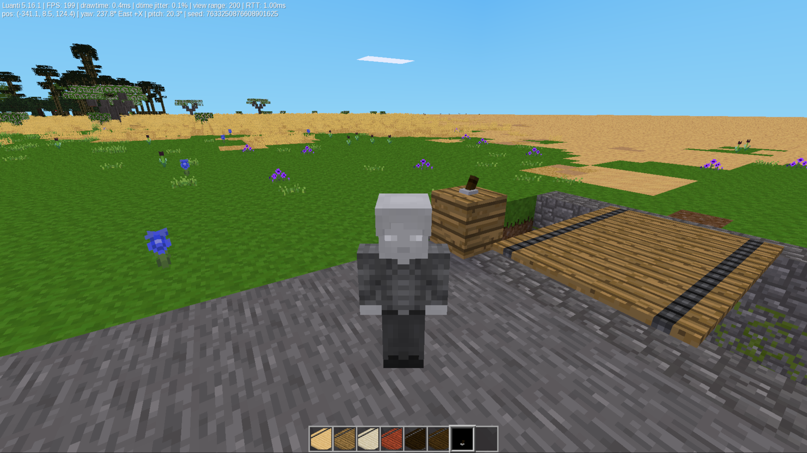
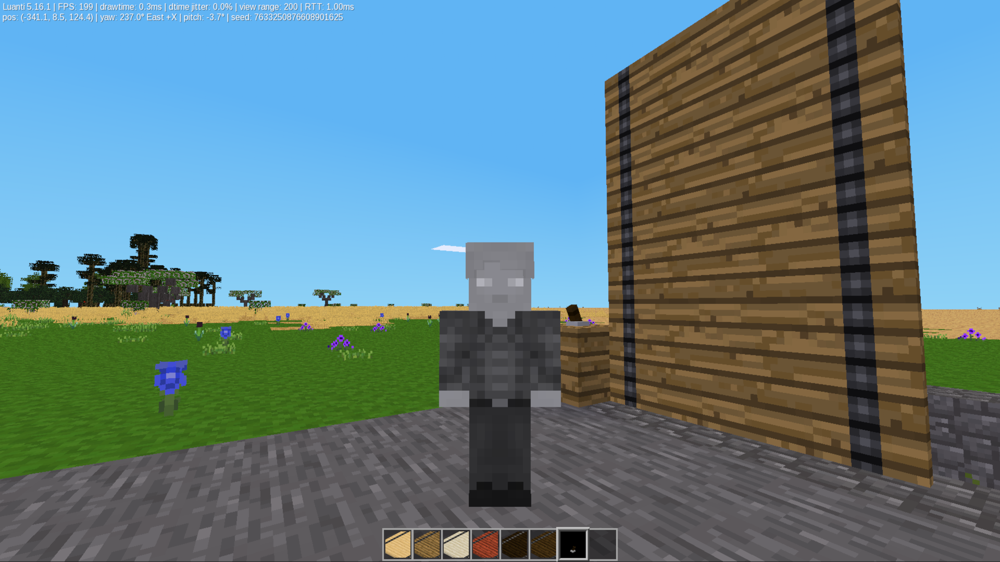
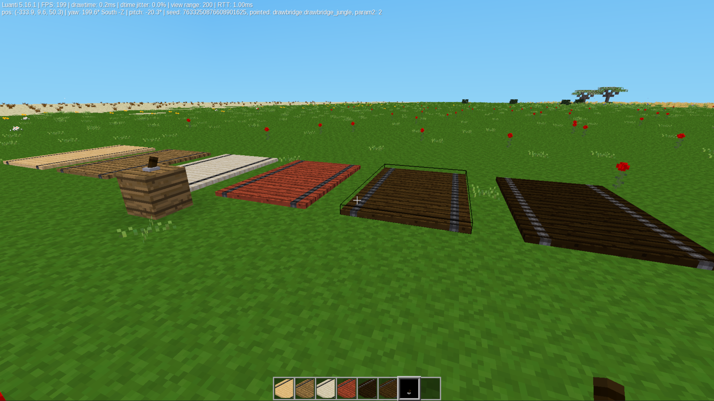
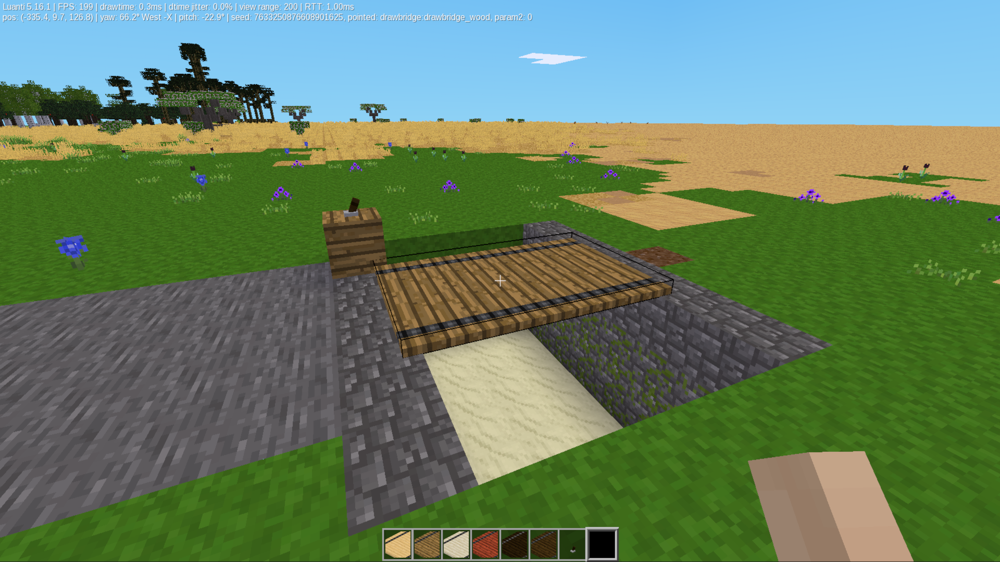

# Drawbridge Mod

This mod adds drawbridges and a control lever to the Minetest Game,
which may be useful in CTF type gameplay (if allowed)..

## Features
* **Covers all of the default wood types and one custom:**
* **Smooth-(ish) Animation:** Drawbridge uses a light animation process.
* **Remote Control Levers:** Lever controls bridges from up to 15 blocks away.
* **Great Sounds:** Mechanical cranking sound when drawbridge lowers & raises.

## How to Use the Lever
1. Place down a drawbridge and a lever nearby (within 15 blocks).
2. Put a **Steel Ingot** in your hand.
3. Right-click the lever with the steel ingot to link it to the bridge.
4. Put the ingot away. You can now right-click the lever with an empty hand to raise and lower the bridge.

## Screenshots

