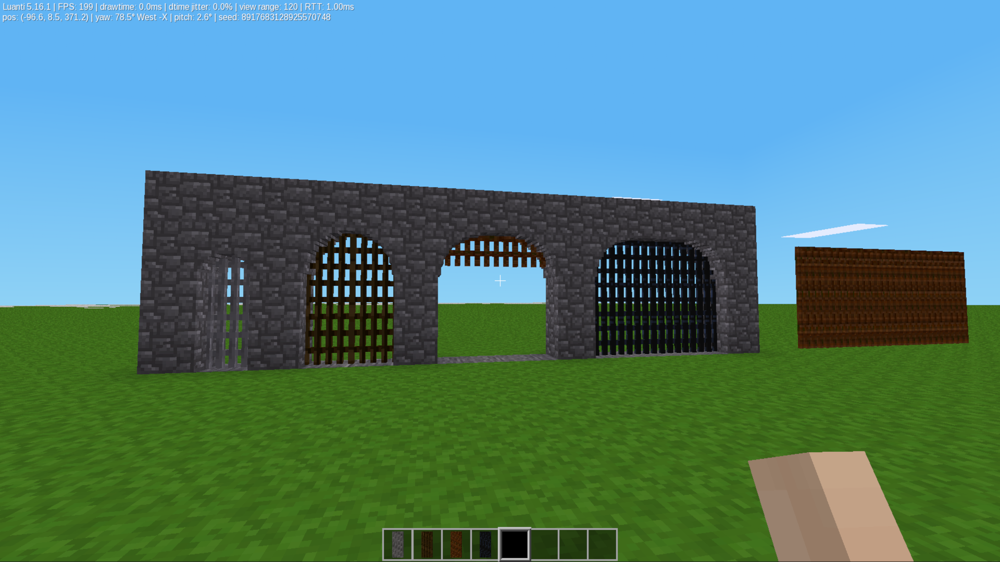

# Portcullis (`portcullis`)

A standalone expansion for **Minetest Game / Luanti**, created by **TumeniNodes**. Part of the `build_pack_01` collection.

This mod introduces heavy-duty, 3D triple-height (3-node tall) portcullis gates, which can be used for fortresses, high-security compounds, and keep perimeters.
The intended way to set/place these nodes is to aim one node above where you want the bottom to sit..
This seems difficult, but with time it becomes like second nature.
To place a portcullis next to another, Shift/Right-Click

## Features

* **Tall Nodeboxes:** 3-node tall 3D panels spanning a single block layer.
* **Industrial Themes:** Old Wood, Wrought Iron, Structural Steel, and Rusted Iron.

## Installation

## License

* **Code:** MIT
* **Media:** CC-BY-SA 4.0 (See LICENSE)

