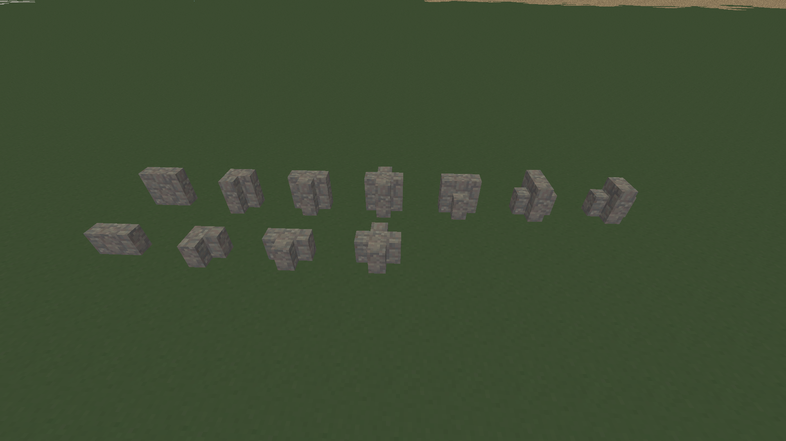

# Thin Walls (`thin_walls`)

A standalone interior design expansion for **Minetest Game / Luanti**, created by **TumeniNodes**. Part of the `build_pack_01` collection.

This mod implements space-saving, full-height and low partition wall elements. It allows builders to partition indoor rooms neatly without wasting an entire 1-node coordinate grid cell on divider blocks.

## Features

* **Various Nodes:** Standard Thin Walls, Two-Way, Three-Way, and Four-Way intersections.
* **Modular Walls:** Includes Low Thin Walls and transitional High-to-Low or Low-to-High variants for clean visual grading.
* **Materials:** Integrates seamlessly across 24 core materials covering heavy stone varieties, fired brick/clay, and all default timber boards.

## Installation

Ensure this folder is placed inside your world's `mods/` directory or parent modpack folder and named exactly `thin_walls`.

## License

* **Source Code:** MIT License (See `LICENSE` for details)
* **Media Assets:** CC-BY-SA 4.0 (See `LICENSE` for details)

